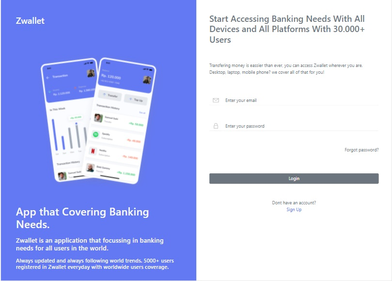

# Zwallet App

This project contains slicing codes from the Zwallet mockup which can be accessed at the following [link](https://www.figma.com/file/YddmKtK1PafpeyUkeSyIiq/Zwallet---Client%3A-Arkademy?node-id=0%3A1). It is currently still on development progress. Built using REACT JS for the frontend, whereas backend is using MySQL.

## How to clone

In the project directory, you can follow steps below to clone it:

###  `1. git clone https://github.com/dindachyfr/zwallet-react-nob.git`

###  `2. npm install`

To install the packages within the project directory

###  `3. npm start`

Please have fun trying out this project!

## Available Features

- Dont have an account yet? Please **Sign Up**. Our register feature has been completed with verification email. Once you sign your email up to Zwallet, a verification link will be sent right away to your email so you'll be able to log in.
- You can **Set your PIN** after finishing registration to secure your account, your wallet, and your data with 6 digits PIN you created yourself.
- Have you activated your account through the verification on email? Well, lets **Log In** then!
- All of your activity summaries will be shown on **Home Page**, including your **Transaction History** and **Balance Availability**
- Setting new **profile picture** or **new PIN**, and **managing phone number**? Please go to **Profile** page >> **Personal Information** page
- You can transfer some amount of money to other users by clicking the **Transfer** on sidebar of Home Page

## Snippets

- Login

- Sign Up

## Learn More

You can learn more in the [Create React App documentation](https://facebook.github.io/create-react-app/docs/getting-started).

To learn React, check out the [React documentation](https://reactjs.org/).

### Code Splitting

This section has moved here: [https://facebook.github.io/create-react-app/docs/code-splitting](https://facebook.github.io/create-react-app/docs/code-splitting)

### Analyzing the Bundle Size

This section has moved here: [https://facebook.github.io/create-react-app/docs/analyzing-the-bundle-size](https://facebook.github.io/create-react-app/docs/analyzing-the-bundle-size)

### Making a Progressive Web App

This section has moved here: [https://facebook.github.io/create-react-app/docs/making-a-progressive-web-app](https://facebook.github.io/create-react-app/docs/making-a-progressive-web-app)

### Advanced Configuration

This section has moved here: [https://facebook.github.io/create-react-app/docs/advanced-configuration](https://facebook.github.io/create-react-app/docs/advanced-configuration)

### Deployment

This section has moved here: [https://facebook.github.io/create-react-app/docs/deployment](https://facebook.github.io/create-react-app/docs/deployment)

### `npm run build` fails to minify

This section has moved here: [https://facebook.github.io/create-react-app/docs/troubleshooting#npm-run-build-fails-to-minify](https://facebook.github.io/create-react-app/docs/troubleshooting#npm-run-build-fails-to-minify)
